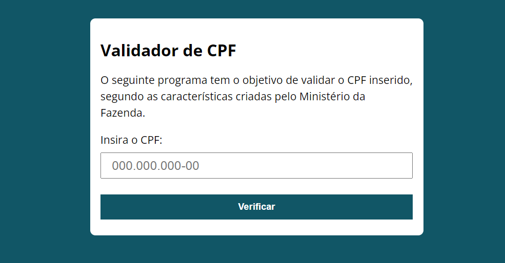

# Validador de CPF

Trata-se de um simples válidador de CPF seguindo as regras e os parâmetros criados pelo Ministerio da Fazenda.

## Conhecimentos Utilizados

O sistema em suma maioria foi feito apenas com `JS`, utilizando o Front-End apenas para a interação com o usuário. Eis os conceitos de `JS` utilizados:

* Prototype;
* Funções;
* Código Limpo;
* Metodos de Js;

## Pagina

